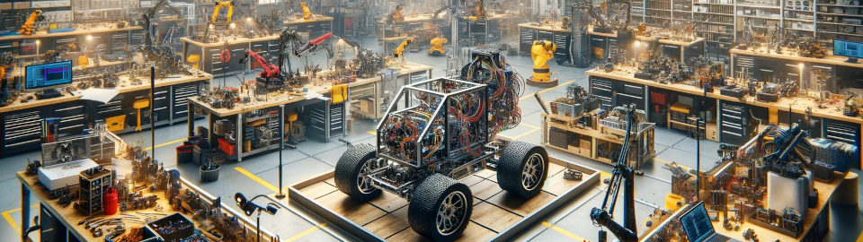

# Robotics Deployment Development Environment

### About

---

Requirement of local installs are equal to the items that are installed in the Dockerfile. Please follow the Dockerfile for the most up to date list of installs.

Afterwards run the ./install.bash script to install the neovim configurations to the correct directions.

It is also recommended to install:
- alacritty for the terminal emulator. (This allows easy font, theme and transparency configurations)
- NerdFont

The robotics deployment folder structure is as follows:

- /...<your root folder>.../roboticsdeployment/dev (This repository)
- /...<your root folder>.../roboticsdeployment/server
- /...<your root folder>.../roboticsdeployment/ui
- /...<your root folder>.../roboticsdeployment/package...
- etc...

